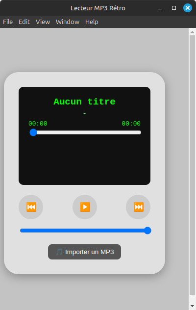

# 🎵 MP3 Retro Player - E-pad

An elegant retro MP3 player inspired by the classic iPod, built with Electron.


## 🚀 Quick Start - Download Now!

**Ready to use? Skip the setup and download the app directly:**

<div align="center">

### 📥 [**Download Latest Release**](https://github.com/NoaKajou/E-pad/releases/latest) 📥

**Available for Windows • macOS • Linux**

</div>

---

## 📋 Description

E-pad is a modern MP3 player with a nostalgic design inspired by the classic iPod. It offers a simple and intuitive user interface to listen to your favorite music tracks with characteristic retro styling.

## 📸 Preview

<div align="center">



*Classic iPod-style interface with green monochrome screen*

</div>

### ✨ Features

- 🎶 **MP3 File Playback** - Complete support for MP3 audio files
- 📱 **Classic iPod Interface** - Nostalgic design with green monochrome screen
- 🎮 **Intuitive Controls** - Play/pause, previous/next buttons
- 📜 **Playlist Management** - Automatic track addition and management
- 🔊 **Volume Control** - Integrated volume slider
- 💾 **Auto-Save** - Your playlist is automatically saved
- ⏱️ **Progress Bar** - Track progress visualization and control
- 🖥️ **Desktop Application** - Runs natively on Windows, macOS, and Linux

## 🚀 Installation

### � Download Ready-to-Use App

**🎯 Want to use E-pad right now? Skip the setup!**

<div align="center">

### [**📦 Download Latest Release**](https://github.com/NoaKajou/E-pad/releases/latest)

**Choose your platform:**
- 🖥️ **Windows**: Download the `.exe` file
- 🍎 **macOS**: Download the `.zip` file (Intel & Apple Silicon supported)
- 🐧 **Linux**: Download the `.AppImage` file

</div>

---

### �🛠️ Build from Source

**For developers**:

### Prerequisites

- **Node.js** (version 16 or higher)
- **npm** (usually included with Node.js)

### Dependencies

This project uses the following key dependencies:
- **Electron** - For creating the desktop application
- **music-metadata** - For extracting audio file metadata (artist, title, duration, etc.)

### Installation Steps

1. **Clone the repository**
   ```bash
   git clone https://github.com/your-username/E-pad.git
   cd E-pad
   ```

2. **Install dependencies**
   ```bash
   npm install
   ```

3. **Run the application in development mode**
   ```bash
   npm start
   ```

### 🔧 Building the Application

To create an executable for your current operating system:

```bash
npm run build
```

The executable will be generated in the `dist/` folder.

#### 🌍 Cross-Platform Building

**Building from Linux** (your current system):
```bash
# Build for Linux (native) ✅
npx electron-builder --linux

# Build for Windows (requires Wine) ⚠️
sudo apt-get install wine
npx electron-builder --win

# Build for macOS (limited support) ⚠️
npx electron-builder --mac  # Creates .zip files, not .dmg
```

**Build Results:**
- **Linux**: `MP3 Retro Player-1.0.0.AppImage` 
- **Windows**: `MP3 Retro Player 1.0.0.exe` (portable executable)
- **macOS**: 
  - `MP3 Retro Player-1.0.0-mac.zip` (Intel x64)
  - `MP3 Retro Player-1.0.0-arm64-mac.zip` (Apple Silicon)

**Limitations:**
- **DMG files**: Can only be created on macOS
- **Code signing**: Requires platform-specific certificates
- **Windows installers**: May require Wine on Linux

#### 🚀 Recommended: Use GitHub Actions

For easy multi-platform builds, use GitHub Actions (see `.github/workflows/build.yml`):

```yaml
name: Build and Release
on:
  push:
    tags: ['v*']
jobs:
  build:
    runs-on: ${{ matrix.os }}
    strategy:
      matrix:
        os: [ubuntu-latest, windows-latest, macos-latest]
    steps:
      - uses: actions/checkout@v3
      - uses: actions/setup-node@v3
        with:
          node-version: '18'
      - run: npm install
      - run: npm run build
```

## 🎯 Usage

### First Launch

1. Launch the application with `npm start`
2. Click the **"🎵 Import MP3"** button
3. Select an MP3 file from your computer
4. The track starts playing automatically

### Controls

- **▶️/⏸️** : Play/Pause
- **⏮️** : Previous track
- **⏭️** : Next track
- **🔊** : Volume control (bottom slider)
- **Progress bar** : Click to navigate through the track

### Playlist Management

- Imported tracks are automatically added to your playlist
- The playlist is automatically saved
- On restart, your playlist is restored

## 🏗️ Project Architecture

```
E-pad/
├── main.js              # Main Electron process
├── preload.js           # Preload script (security)
├── package.json         # Project configuration
├── renderer/            # User interface
│   ├── index.html       # HTML structure
│   ├── index.js         # Interface logic
│   └── style.css        # CSS styles (iPod design)
└── README.md           # Documentation
```

### Technologies Used

- **Electron** - Desktop application framework
- **HTML5 Audio API** - Audio file playback
- **CSS3** - Styling and animations
- **JavaScript ES6+** - Application logic
- **Node.js** - JavaScript runtime
- **music-metadata** - Audio file metadata extraction

## 🔧 Development

### Code Structure

#### `main.js` - Main Process
- Electron window management
- File selection via native dialog
- Playlist save/load functionality
- IPC communication with renderer
- Audio metadata extraction using music-metadata

#### `renderer/index.js` - User Interface
- Audio playback controls
- Playlist management
- Interactive user interface
- Audio API synchronization

#### `preload.js` - Security
- Secure bridge between main and renderer
- Exposes necessary Electron APIs

#### `renderer/style.css` - Design
- Classic iPod styling
- Green monochrome screen
- Retro buttons and controls

### Available Scripts

```json
{
  "start": "electron .",      // Run in dev mode
  "build": "electron-builder" // Build executable
}
```

## 🎨 Customization

### Modify the Theme

Edit `renderer/style.css` to customize:
- Screen colors (currently green monochrome)
- Window size
- Button styles
- Animations

### Add Audio Formats

Modify `main.js` line 48 to support other formats:
```javascript
filters: [{ name: 'Audio', extensions: ['mp3', 'wav', 'ogg'] }]
```

## 🐛 Troubleshooting

### Build Issues

**Wine required for Windows builds on Linux**:
```bash
# Install Wine on Ubuntu/Debian
sudo apt-get install wine

# Then try building for Windows again
npx electron-builder --win
```

**Cross-platform limitations**:
- **Linux → Windows**: Requires Wine
- **Linux → macOS**: Not supported (use GitHub Actions)
- **Windows → macOS**: Not supported
- **macOS → All**: Fully supported

**Missing author in package.json**:
Add an author field to your `package.json`:
```json
"author": "Your Name <your.email@example.com>"
```

**Missing app icon**:
- The build uses default Electron icon
- Add custom icons in `assets/` folder for better branding

### Application Issues

### Application won't start
- Check that Node.js is installed: `node --version`
- Reinstall dependencies: `rm -rf node_modules && npm install`

### No sound is audible
- Check that system volume is not muted
- Check the volume slider in the application
- Make sure the MP3 file is not corrupted

### Playlist doesn't save
- Check write permissions in the user folder
- The playlist file is stored in `userData/playlist.json`

## 📝 License

This project is licensed under the MIT License. See the `LICENSE` file for more details.

## 👥 Contributing

Contributions are welcome! To contribute:

1. Fork the project
2. Create a feature branch (`git checkout -b feature/new-feature`)
3. Commit your changes (`git commit -m 'Add new feature'`)
4. Push to the branch (`git push origin feature/new-feature`)
5. Open a Pull Request

## 🔮 Future Features

- [x]upport for additional audio formats (WAV, FLAC, OGG)
- [ ] Integrated audio visualizer
- [ ] Graphic equalizer
- [ ] Shuffle and repeat modes
- [ ] Track metadata (artist, album, artwork)
- [ ] Global keyboard shortcuts
- [ ] Customizable themes
- [ ] Full-screen mode

## 📞 Support

If you encounter problems or have questions:
- Open an issue on GitHub
- Check the troubleshooting section above

---

Developed with ❤️ and nostalgia for the classic iPod era.
