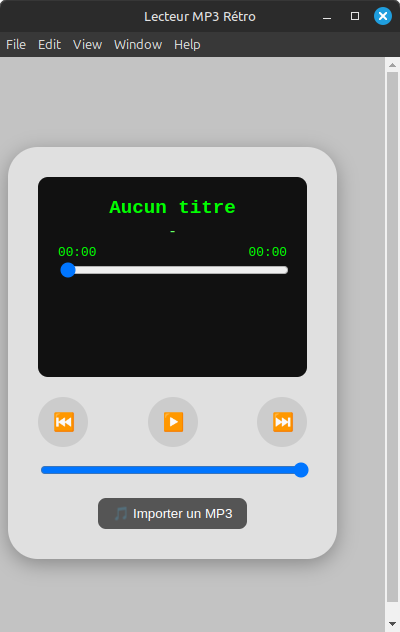

# MP3 Retro Player - E-pad

An elegant retro MP3 player inspired by the classic iPod, built with Electron.


## Quick Start

Download the latest build directly from GitHub Releases:

[Download Latest Release](https://github.com/NoaKajou/E-pad/releases/latest)

Available platforms:
- Windows (`.exe`)
- macOS (`.zip`, Intel and Apple Silicon)
- Linux (`.AppImage`)

Release assets also include `.blockmap` files for update workflows.

## Description

E-pad is a modern MP3 player with a nostalgic iPod-style interface. It is designed to be simple, lightweight, and cross-platform.

## Preview



Classic iPod-style interface with a monochrome display.

## Features

- MP3 file playback
- iPod-style UI with dedicated transport controls
- Playlist management and persistence
- Track metadata reading (title, artist, album, duration)
- Shuffle and repeat playback modes
- Progress bar seek support
- Volume control slider
- Theme selector (Classic, Dark, Blue, Retro)
- Desktop support for Windows, macOS, and Linux

## Installation

### Option 1: Use Prebuilt App

Download the latest release:

[Download Latest Release](https://github.com/NoaKajou/E-pad/releases/latest)

Choose your platform package:
- Windows: `.exe`
- macOS: `.zip`
- Linux: `.AppImage`

### Option 2: Build From Source

#### Prerequisites

- Node.js 18 or higher
- npm

#### Steps

1. Clone the repository:

```bash
git clone https://github.com/NoaKajou/E-pad.git
cd E-pad
```

2. Install dependencies:

```bash
npm install
```

3. Run in development mode:

```bash
npm start
```

4. Build for your current OS:

```bash
npm run build
```

Build output is generated in `dist/`.

## Build and Release Automation

This repository uses GitHub Actions to build and publish releases automatically.

Workflow file:
- `.github/workflows/release.yaml`

Current behavior:
- Trigger: push to `main`
- Build matrix: Linux, Windows, macOS
- Uploads release files: `.AppImage`, `.exe`, `.zip`, `.blockmap`
- Release tag format: `v<package.json version>`

## Icon Handling

To avoid accidental icon pickup from repository root:

- `icon.png` at project root is excluded from packaged files via `build.files` (`!icon.png`)
- Custom platform icons are disabled with:
  - `build.win.icon: false`
  - `build.mac.icon: false`
  - `build.linux.icon: false`

This forces electron-builder to use Electron default icon behavior and ignore root `icon.png` for app icon resolution.

## Usage

### First Launch

1. Start the app (`npm start`) or open the installed build.
2. Click `Importer un fichier son`.
3. Select an MP3 file.
4. Playback starts automatically.

### Controls

- Play/Pause
- Previous / Next
- Shuffle toggle
- Repeat toggle
- Progress seek bar
- Volume slider

### Playlist

- Imported tracks are added to playlist automatically
- Playlist is saved and restored between sessions

## Project Structure

```text
E-pad/
├── main.js
├── preload.js
├── package.json
├── renderer/
│   ├── index.html
│   ├── index.js
│   └── style.css
├── .github/
│   └── workflows/
│       └── release.yaml
└── README.md
```

## Technologies

- Electron
- JavaScript (ES6+)
- HTML5 Audio API
- CSS3
- Node.js
- music-metadata
- node-id3

## Troubleshooting

### Build Issues

Windows builds on Linux may require Wine:

```bash
sudo apt-get install wine
npx electron-builder --win
```

Cross-platform notes:
- Linux to macOS local builds are not supported
- Windows to macOS local builds are not supported
- For full cross-platform output, use GitHub Actions

### App Issues

App does not start:
- Check Node.js version: `node --version`
- Reinstall dependencies: `rm -rf node_modules && npm install`

No audio output:
- Check system volume
- Check app volume slider
- Verify MP3 file validity

Playlist not saved:
- Check write permissions in user data folder

## License

This project is licensed under the MIT License.

## Contributing

1. Fork the project
2. Create a feature branch (`git checkout -b feature/new-feature`)
3. Commit changes (`git commit -m "Add new feature"`)
4. Push branch (`git push origin feature/new-feature`)
5. Open a Pull Request

## Support

If you encounter issues or have questions:
- Open an issue on GitHub
- Check the troubleshooting section above
